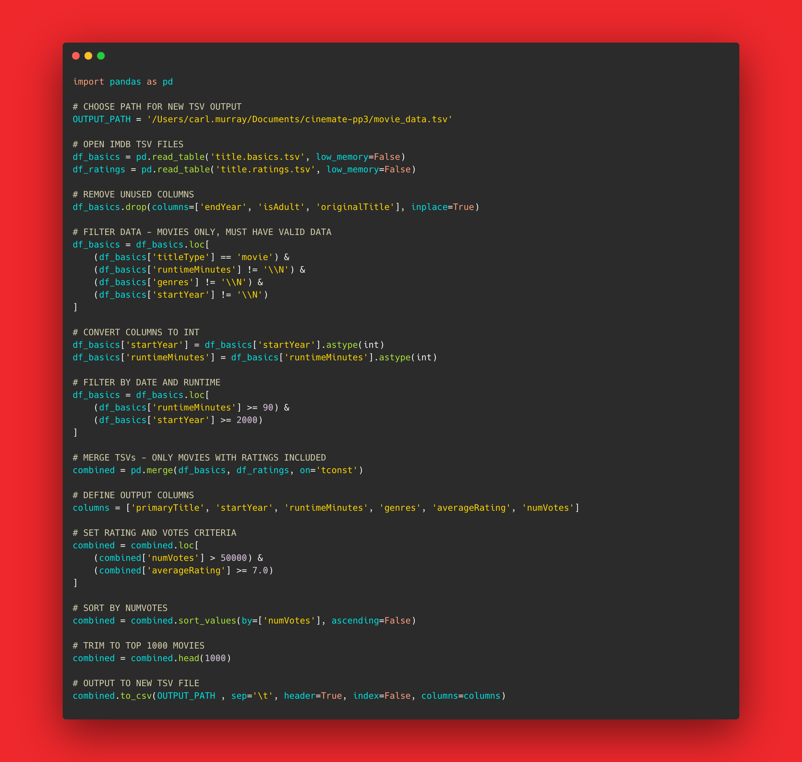

# CineMate


---

# Table of Contents
TBD

---

# Project Background

CineMate is a Python command line application designed to make it easy for users to browse and explore movies. Powered by an extensive dataset from IMDB, CineMate focuses on the top 1000 rated movies since the year 2000, offering users a curated selection of films.

The primary objective of CineMate is to provide users with an effortless movie discovery process. With CineMate, users can search for movies, navigate through them by year or genre, and uncover hidden cinematic gems. By harnessing the capabilities of Python, CineMate simplifies the task of finding and selecting movies, catering to both casual viewers and avid film enthusiasts.

CineMate offers features that enrich the user experience. Users can add their favorite movies to a personalized favorites list, ensuring easy access to beloved films. Furthermore, CineMate enables users to maintain a watched list, allowing them to keep track of their movie-watching history and receive personalized recommendations based on their preferences.

With CineMate, finding your next movie masterpiece has never been easier.

---

# Features

## Roadmap

---

# Code Structure & Logic

## Data Processing

- Two `.tsv` [datasets from IMDB](https://developer.imdb.com/non-commercial-datasets/) were used in this project - one file containing movie titles, release dates and genres; and the other containing movie ratings. The dataset had over 9 million rows of data and included documentaries, shorts, TV shows etc. For the purposes of this project, the dataset needed to be filtered down to a usable set of movies only.
- Before development of the main application (`run.py`), a Python script was written to process the datasets.
- Utilising the [`pandas`](https://pandas.pydata.org/) library, the script `data_cleanup.py` reads the two `.tsv` files, removes irrelevant columns, applies filters, merges the two datasets and finally exports a new `.tsv` file containing the top 1000 movies.
- The filters applied are as follows:
    - Type: Movies
    - Runtime: 90 minutes or longer
    - Release Year: 2000 onwards
    - Avg. Rating: 7.0 with 50,000+ votes
    - Sorted by Number of Votes and trimmed to 1000 rows
- This process could have been carried out in the main application, but would have led to significant wait times on initial loading of the application due to the amount of data in the datasets.

<details>
<summary>Code Block</summary>
</details>

## Data Model

### `Movie` Class

- A `Movie` Class was created to contain the data for each movie instance from the dataset. 
- The `Movie` Class has the following attributes:
    - `index`: List index number when printing list of movies
    - `title`: Title of movie
    - `date`: Release year of movie
    - `runtime`: Runtime in minutes 
    - `genres`: Genres applicable to movie
    - `rating`: Average rating from IMDB ratings
    - `votes`: Number of rating votes from IMDB ratings
- The `__str__` method of this Class prints the movie in a tabular format.

### `Movies` Class

- A `Movies` Class was created to contain the full dataset of movies in a list
- The contructor takes two arguments:
    - `top_100`: A global variable containing the Top 100 movies list which is created upon initialisation by the `create_top_100()` function.
    - `all_movies`: A global variable containing the full list of movies from the dataset which is created upon initialisation by the `get_movies()` function.
- The `Movies` Class has the following attributes:
    - `top_100`: A list of the Top 100 movies; created upon initialisation of the program.
    - `all_movies`: A list of all movies in the dataset; created upon initialisation of the program.
    - `favourites`: A list of user-selected favourite movies
    - `watchlist`: A list of user-selected movies intended to be watched later by the user
- The `print_movies` method takes either `top_100` or `all_movies` as arguments and prints them in a tabular list.

---

# Technologies Used

- The application was developed with [Python](https://www.python.org/)
- A non-commercial freely available dataset from IMDB was used and consists of two subsets: `title.basics.tsv`; `title.ratings.tsv` ([Available here](https://datasets.imdbws.com/))
    - Note: These files are not included in the GitHub Repository due to their large size
- [Heroku](https://www.heroku.com/platform) was used for deployment
- [Jupyter Notebooks](https://jupyter.org/) and [VS Code](https://code.visualstudio.com/) were used for development
- The [Pandas](https://pandas.pydata.org/) library was used for processing the original datasets.

---

# Testing

## Test Process

## Bugs

### Resolved

### Unresolved

---

# Deployment

## Pre-deployment (Optional)
**Note:** This step is only required if you want to change the filters applied to the processed dataset, or if you want to download the latest data from IMBD (IMDB updates datasets daily)

1. Download the datasets: `title.basics.tsv`; `title.ratings.tsv` ([Available here](https://datasets.imdbws.com/))
2. Download the repository (or just download `data_cleanup.py`)
3. Ensure you have the Pandas library installed with the command `pip install pandas`
4. Open `data_cleanup.py`. Specify filepaths to read the datasets and your desired `OUTPUT_PATH` on lines `4`, `7` and `8`.

```python
# CHOOSE PATH FOR NEW TSV OUTPUT
OUTPUT_PATH = 'SPECIFY OUTPUT PATH HERE' 

# OPEN IMDB TSV FILES
df_basics = pd.read_table('YOUR_PATH/title.basics.tsv', low_memory=False)
df_ratings = pd.read_table('YOUR_PATH/title.ratings.tsv', low_memory=False)
```
5. If desired, change the filters applied to the data to your liking as noted in the docstrings. The default filters are specified at [Data Processing](#data-processing).
5. Run the script - if successful, a new `.tsv` file will be found at your specified `OUTPUT_PATH`

## Deployment to Heroku
...

---

# Credits, Resources & Acknowledgements
- Harvard CS50’s Introduction to Computer Science ([CS50x](https://cs50.harvard.edu/x/2023/))
- Harvard CS50’s Introduction to Programming with Python ([CS50P](https://cs50.harvard.edu/python/2022/))
- Code Institute [repository template](https://github.com/Code-Institute-Org/python-essentials-template) used for deployment
- The Complete Python Bootcamp From Zero to Hero in Python, Jose Portilla ([Udemy](https://www.udemy.com/course/complete-python-bootcamp/))