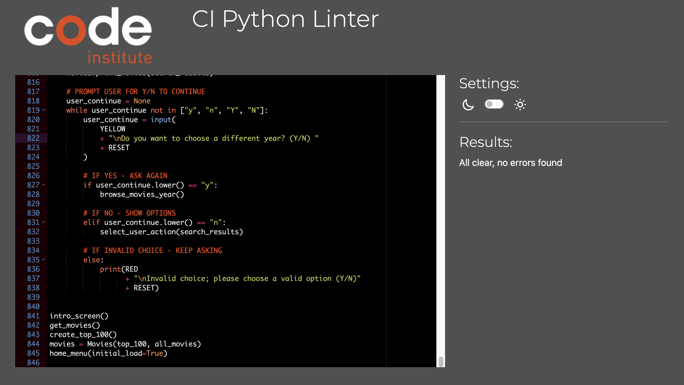

# CineMate


---

# Table of Contents
TBD

---

# Project Background

CineMate is a Python command line application designed to make it easy for users to browse and explore movies. Powered by an extensive dataset from IMDB, CineMate focuses on the top 1000 rated movies since the year 2000, offering users a curated selection of films.

The primary objective of CineMate is to provide users with an effortless movie discovery process. With CineMate, users can search for movies, navigate through them by year or genre, and uncover hidden cinematic gems. By harnessing the capabilities of Python, CineMate simplifies the task of finding and selecting movies, catering to both casual viewers and avid film enthusiasts.

CineMate offers features that enrich the user experience. Users can add their favorite movies to a personalized favorites list, ensuring easy access to beloved films. Furthermore, CineMate enables users to maintain a watched list, allowing them to keep track of their movie-watching history and receive personalized recommendations based on their preferences.

With CineMate, finding your next movie masterpiece has never been easier.

---

# Features

- On initialisation, CineMate shows users a home menu which clearly communicates the intent of the application and provides the user with options for navigation.
- Favourites/Watch List: CineMate allows users add movies to a favourites list for movies they particularly liked. There is also a 'watch list' feature which lets users easily save movies for later viewing. Movies can be easily added or removed from these lists.
- Browsing: CineMate lets user browse movies by search, genre or release year. 
    - Search: Users can enter a search query which will compare the movie titles against the query and show any relevant results.
    - Genre: Users can select a genre they are interested in and CineMate will show all relevant movies within that genre.
    - Year: Users can select a specific year and CineMate will show relevant movies released in that year.
- UI: The UI has some basic styling applied which makes information easily readable:
    - Movies are printed with a blue background while the list headers are printed in green. 
    - User prompts are coloured yellow so they stand out.
    - Menu options are green to differentiate them from other information on screen/
    - Error messages are red to indicate a problem.


## Roadmap

- Improve browsing experience by letting users select multiple genres or enter a range of years to browse by.
- Paginate movie lists to avoid having long lists print on screen.

---

# Code Structure & Logic

## Data Processing

- Two `.tsv` [datasets from IMDB](https://developer.imdb.com/non-commercial-datasets/) were used in this project - one file containing movie titles, release dates and genres; and the other containing movie ratings. The dataset had over 9 million rows of data and included documentaries, shorts, TV shows etc. For the purposes of this project, the dataset needed to be filtered down to a usable set of movies only.
- Before development of the main application (`run.py`), a Python script was written to process the datasets.
- Utilising the [`pandas`](https://pandas.pydata.org/) library, the script `data_cleanup.py` reads the two `.tsv` files, removes irrelevant columns, applies filters, merges the two datasets and finally exports a new `.tsv` file containing the top 1000 movies.
- The filters applied are as follows:
    - Type: Movies
    - Runtime: 90 minutes or longer
    - Release Year: 2000 onwards
    - Avg. Rating: 7.0 with 50,000+ votes
    - Sorted by Number of Votes and trimmed to 1000 rows
- This process could have been carried out in the main application, but would have led to significant wait times on initial loading of the application due to the amount of data in the datasets.

<details>
<summary>Code Block</summary>
</details>

## Data Model

### `Movie` Class

- A `Movie` Class was created to contain the data for each movie instance from the dataset. 
- The `Movie` Class has the following attributes:
    - `index`: List index number when printing list of movies
    - `title`: Title of movie
    - `date`: Release year of movie
    - `runtime`: Runtime in minutes 
    - `genres`: Genres applicable to movie
    - `rating`: Average rating from IMDB ratings
    - `votes`: Number of rating votes from IMDB ratings
- The `__str__` method of this Class prints the movie in a tabular format.

### `Movies` Class

- A `Movies` Class was created to contain the full dataset of movies in a list
- The contructor takes two arguments:
    - `top_100`: A global variable containing the Top 100 movies list which is created upon initialisation by the `create_top_100()` function.
    - `all_movies`: A global variable containing the full list of movies from the dataset which is created upon initialisation by the `get_movies()` function.
- The `Movies` Class has the following attributes:
    - `top_100`: A list of the Top 100 movies; created upon initialisation of the program.
    - `all_movies`: A list of all movies in the dataset; created upon initialisation of the program.
    - `favourites`: A list of user-selected favourite movies
    - `watchlist`: A list of user-selected movies intended to be watched later by the user
- The `print_movies` method takes either `top_100` or `all_movies` as arguments and prints them in a tabular list.

### UML Class Diagram
The below diagram shows the relationship between the `Movie` and `Movies` Classes:


---

# Technologies Used

- The application was developed with [Python](https://www.python.org/)
- A non-commercial freely available dataset from IMDB was used and consists of two subsets: `title.basics.tsv`; `title.ratings.tsv` ([Available here](https://datasets.imdbws.com/))
    - Note: These files are not included in the GitHub Repository due to their large size
- [Heroku](https://www.heroku.com/platform) was used for deployment
- [Jupyter Notebooks](https://jupyter.org/) and [VS Code](https://code.visualstudio.com/) were used for development
- [mermaid.live](https://mermaid.live) was used to generate the UML Class Diagram

## Libraries & Modules
- The [Pandas](https://pandas.pydata.org/) library was used for processing the original datasets.
- The built-in [`csv`](https://docs.python.org/3/library/csv.html) module was used for reading the `.tsv` movies data file.
The built-in [`textwrap`](https://docs.python.org/3/library/textwrap.html) module was used to shorten long movie titles so they would print within the width of the terminal window.

---

# Testing

## Manual Test Process

| Test                        | Action                                                                                                      | Success Criteria                                                                                                                                         |
|-----------------------------|-------------------------------------------------------------------------------------------------------------|----------------------------------------------------------------------------------------------------------------------------------------------------------|
| Navigation                  | Starting from the home menu, navigate through the application, checking that correct action is taken according to user input               | Navigation works as expected. Accepts only inputs shown on menu options. Invalid inputs are handled. Successfully navigate from main menu to sub-menus and vice versa. |
| User input                  | Test all instances where user input is required. Enter valid and invalid inputs.                             | Invalid inputs are handled gracefully. Error message shown. User prompted to try again.                                                                |
| Browse movies by search     | Enter search query that matches a known movie in the dataset. Enter random invalid search query.             | Valid queries show relevant search results. Invalid queries are handled gracefully.                                                                      |
| Browse movies by year       | Browse by year at both ends of accepted input limits. Browse by year within accepted input limits. Browse by year outside of accepted input limits. | Relevant movies shown according to year input. Invalid inputs outside of accepted range are handled gracefully.                                         |
| Browsing movies by genre    | Test browsing by 5 different genres.                                                                         | Genre list prints as expected. Input matches list index. Relevant movies shown according to selected genre.                                            |
| Movie list presentation     | Check: show all; show top 100; show favourites; show watch list; browse by genre/year/search to ensure lists print as intended               | Only relevant movie lists print for the given context. Index numbering is correct.                                                                       |
| Favourites/watch list       | Add 5 random movies to both favourites and watch list. View favourites/watch list. Remove all movies from lists. y. Add to lists from various contexts (e.g. from search results, top 100 etc.) | Correct movies added to list. Lists print correctly. Feedback messages shown on add/remove. Empty list message shown if empty.                            |

## Error Handling

- Invalid user inputs are handled gracefully and a feedback message is shown to users on invalid input submission.
- This includes:
    - Only accepting input within the given range for menu selections
    - Not allowing users to add the same movie to favourites/watchlist
    - Removing the 'Remove from favourites/watchlist' option when the list is empty to prevent user error
    - Showing a feedback message if no movies match user search query
    - Prompting user to select a valid option within accepted range (e.g. for movie indexes, genre list, browse by year etc.)
    - Acceptable inputs are not case-sensitive (e.g. for Y/N prompts)

## PEP8 Validation
- The code for both `run.py` and `data_cleanup.py` were passed through a [PEP8 validator](https://pep8ci.herokuapp.com/) with no issues present.

<details>
<summary>Validation Screenshot</summary>
</details>


## Bugs

### Resolved
1. When initially testing the 'Add to favourites' feature, I found that when trying to add a favourite from a movie list other than `"Show all movies"` (e.g. adding a favourite from a list of search results), an incorrect movie would be added. This was due to the add-to-favourites function referencing the main list of movies rather than e.g. the search results list. This was fixed by passing an argument to the function to check where the user is coming from i.e. check whether they are trying to add a favourite from a list of search results, top 100 list etc.
2. During development, I noticed a bug where the first 100 movies in `"Show all movies"` would print with incorrect index numbers, **only** after `"Showing top 100"`. This was due to the `Top 100` movies being assigned a new `index` when printing, and not being reassigned to their original value afterwards. This was fixed by using `enumerate()` in the `Movies.print_movies()` method to reassign the correct `index` when printing.

<details>
<summary>Index bug screenshot</summary>


</details>

### Unresolved
- No unresolved bugs
---

# Deployment

## Pre-deployment (Optional)
**Note:** This step is only required if you want to change the filters applied to the processed dataset, or if you want to download the latest data from IMBD (IMDB updates datasets daily)

1. Download the datasets: `title.basics.tsv`; `title.ratings.tsv` ([Available here](https://datasets.imdbws.com/))
2. Download the repository (or just download `data_cleanup.py`)
3. Ensure you have the Pandas library installed with the command `pip install pandas`
4. Open `data_cleanup.py`. Specify filepaths to read the datasets and your desired `OUTPUT_PATH` on lines `4`, `7` and `8`.

```python
# CHOOSE PATH FOR NEW TSV OUTPUT
OUTPUT_PATH = 'SPECIFY OUTPUT PATH HERE' 

# OPEN IMDB TSV FILES
df_basics = pd.read_table('YOUR_PATH/title.basics.tsv', low_memory=False)
df_ratings = pd.read_table('YOUR_PATH/title.ratings.tsv', low_memory=False)
```
5. If desired, change the filters applied to the data to your liking as noted in the docstrings. The default filters are specified at [Data Processing](#data-processing).
5. Run the script - if successful, a new `.tsv` file will be found at your specified `OUTPUT_PATH`

## Deployment to Heroku
...

---

# Credits, 
- Code Institute [repository template](https://github.com/Code-Institute-Org/python-essentials-template) used for deployment
- IMDB for the datasets utilised ([Available here](https://datasets.imdbws.com/))
- The [Pandas](https://pandas.pydata.org/) library was used for processing the original datasets.

# Resources & Acknowledgements
- Harvard CS50’s Introduction to Computer Science ([CS50x](https://cs50.harvard.edu/x/2023/))
- Harvard CS50’s Introduction to Programming with Python ([CS50P](https://cs50.harvard.edu/python/2022/))
- The Complete Python Bootcamp From Zero to Hero in Python, Jose Portilla ([Udemy](https://www.udemy.com/course/complete-python-bootcamp/))